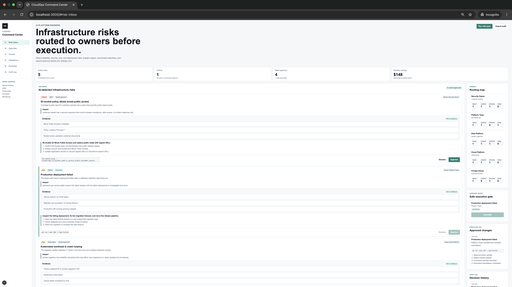
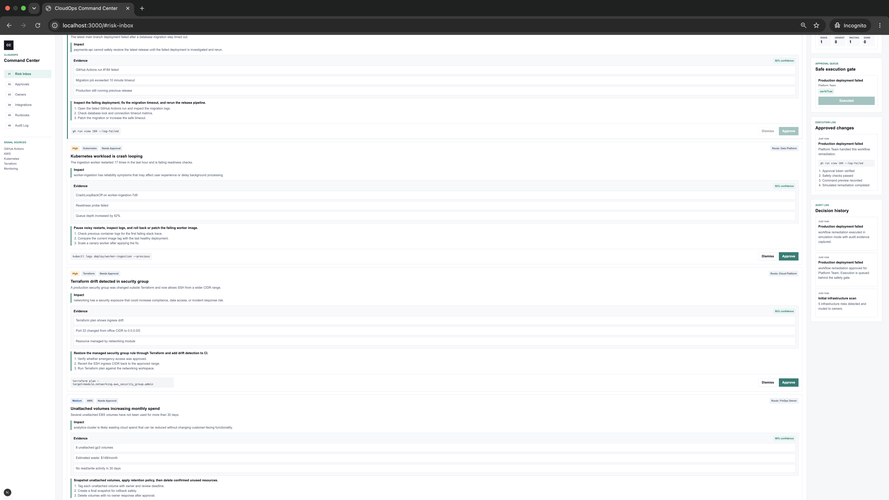
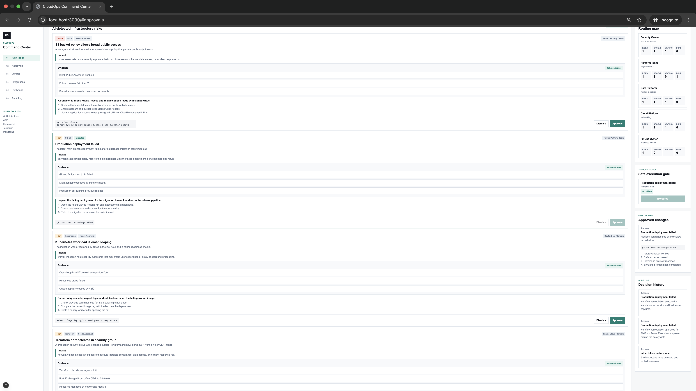
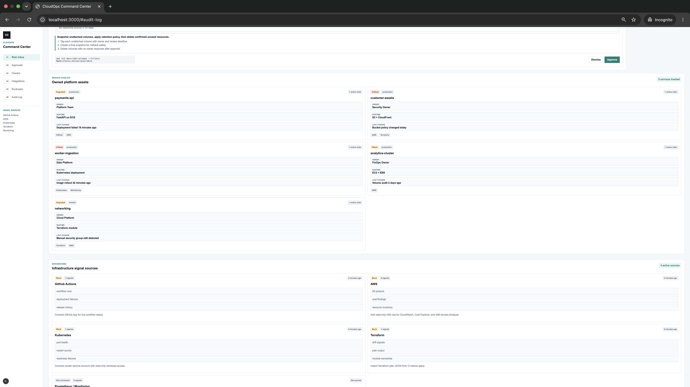
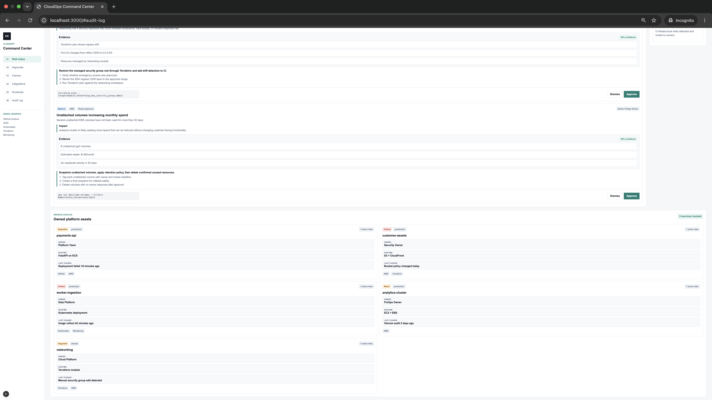
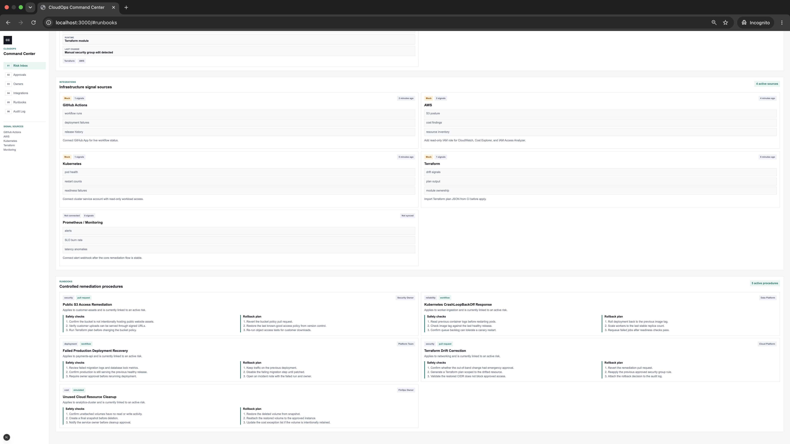

# CloudOps Command Center

## Overview

CloudOps Command Center is an AI-powered platform engineering assistant that detects infrastructure risks, explains their impact, recommends safe remediation steps, routes issues to the correct service owner, and executes only after approval.

The project demonstrates a production-style platform engineering workflow for cloud teams. It combines infrastructure signal ingestion, service ownership, risk explanation, runbooks, approval gates, simulated execution, and audit history in one command center.

---

## Problem It Solves

Cloud and platform teams receive signals from many places:

- GitHub Actions
- AWS
- Kubernetes
- Terraform
- Monitoring systems

The challenge is not only seeing alerts. The real challenge is knowing:

- What is risky?
- Why does it matter?
- Which service is affected?
- Who owns it?
- What is the safe fix?
- Should the fix be executed now?
- Is there an audit trail?

CloudOps Command Center turns disconnected infrastructure signals into explainable, owner-routed, approval-gated remediation workflows.

---

## Core Workflow

User / Platform Engineer
↓
Infrastructure Signals
↓
AI Risk Engine
↓
Evidence + Impact Explanation
↓
Service Owner Routing
↓
Runbook-Based Remediation
↓
Approval Queue
↓
Simulated Execution
↓
Audit Log

---

## Features

### Risk Inbox

- Detects infrastructure risks from mock cloud signals
- Classifies risks by severity and category
- Shows business and technical impact
- Displays raw evidence behind every recommendation
- Shows confidence score for each risk

### Approval Workflow

- Risks require approval before execution
- Approved risks move into the approval queue
- Dismissed risks are removed from active review
- Metrics update as decisions are made

### Execution Log

- Simulates approved remediation execution
- Records safety checks
- Captures command preview
- Stores execution history for auditability

### Owner Routing

- Routes each risk to the correct owner/team
- Tracks active risks per owner
- Shows urgent, waiting, and completed work

### Service Catalog

- Tracks owned platform assets
- Shows owner, runtime, environment, health, last change, linked integrations, and active risk count
- Demonstrates a Backstage-style service ownership model

### Integrations Status

- Shows infrastructure signal sources
- Tracks mock/connected/not connected status
- Displays last sync time, signal count, and what each integration provides

### Runbooks

- Documents remediation procedures
- Includes safety checks and rollback plans
- Connects risks to controlled operational procedures

---

## Demo Risk Sources

The current MVP uses mock signals for:

- Failed GitHub Actions deployment
- Public S3 bucket access risk
- Kubernetes CrashLoopBackOff
- Unattached AWS volumes increasing cost
- Terraform drift in a security group

---

## Architecture

CloudOps Command Center is currently implemented as a frontend-first platform engineering MVP:

- Next.js app renders the command center UI
- TypeScript models infrastructure signals, risks, services, integrations, runbooks, execution events, and audit events
- Mock data simulates real integrations
- Risk engine transforms signals into explainable risks
- React state manages approval, dismissal, execution, metrics, owner routing, and audit history
- Vitest validates risk logic and data relationships
- GitHub Actions workflow validates lint, typecheck, tests, and build

---

## Technologies Used

- Next.js
- React
- TypeScript
- Vitest
- GitHub Actions
- CSS
- Vercel-ready deployment structure

---

## Validation

The project can be validated with:

```bash
npm run lint
npm run typecheck
npm run test
npm run build
```

Current validation coverage checks:

- Risk engine output
- Evidence availability
- Runbook coverage
- Integration catalog coverage
- Service catalog coverage

---

## Local Development

Install dependencies:

```bash
npm install
```

Run locally:

```bash
npm run dev
```

Open:

```bash
http://localhost:3000
```

---

## Future Improvements

- Add Clerk authentication and team roles
- Add Neon Postgres persistence
- Connect live GitHub Actions API
- Add AWS read-only integration
- Import Terraform plan JSON
- Add Kubernetes read-only cluster integration
- Add Prometheus or Alertmanager webhook ingestion
- Add pull request generation for approved remediations
- Add Slack or email notifications for routed owners
- Add billing and workspace support for SaaS readiness

---

## Screenshots

### Dashboard / Risk Inbox



### Evidence View



### Approval + Execution Flow



### Owner Routing



### Service Catalog



### Integrations Status


### Runbooks



---

## Skills Demonstrated

### Platform Engineering

- Service ownership
- Runbooks
- Approval workflows
- Auditability
- Operational safety

### Cloud Engineering

- AWS risk modeling
- Infrastructure signal design
- Cost, security, reliability, and deployment risk categories

### DevOps

- GitHub Actions CI
- TypeScript validation
- Build verification
- Deployment-ready project structure

### Product Engineering

- SaaS-style dashboard
- Workflow-driven UX
- Explainable AI interface
- Portfolio-ready documentation

---

## Author

Olawale Azeez

AWS Certified Solutions Architect - Associate  
AWS Certified Cloud Practitioner  
Cloud Engineer | Platform Engineer | DevOps Engineer
