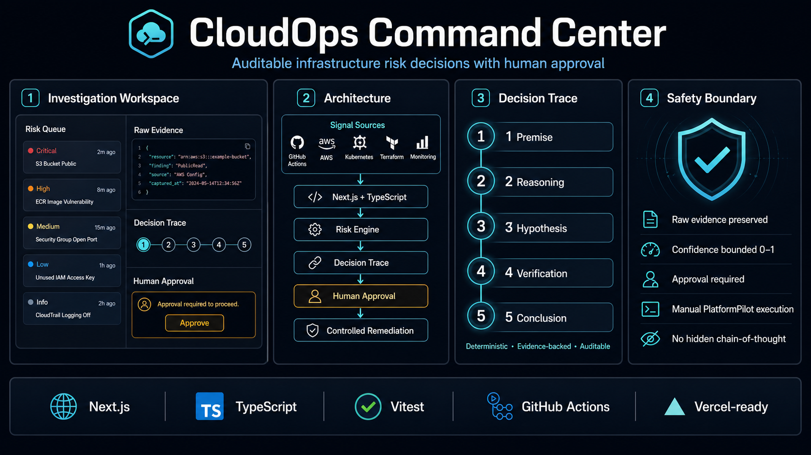
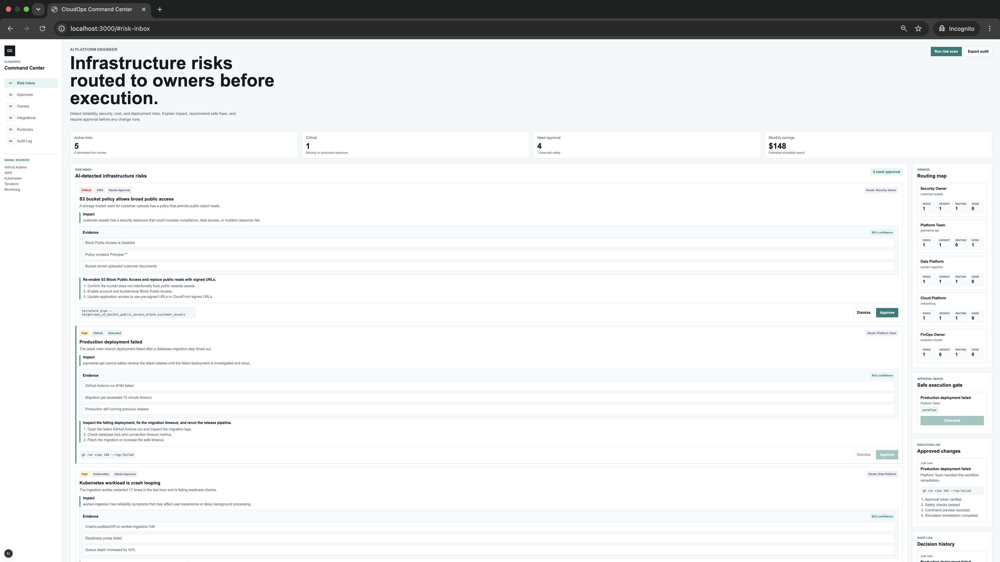
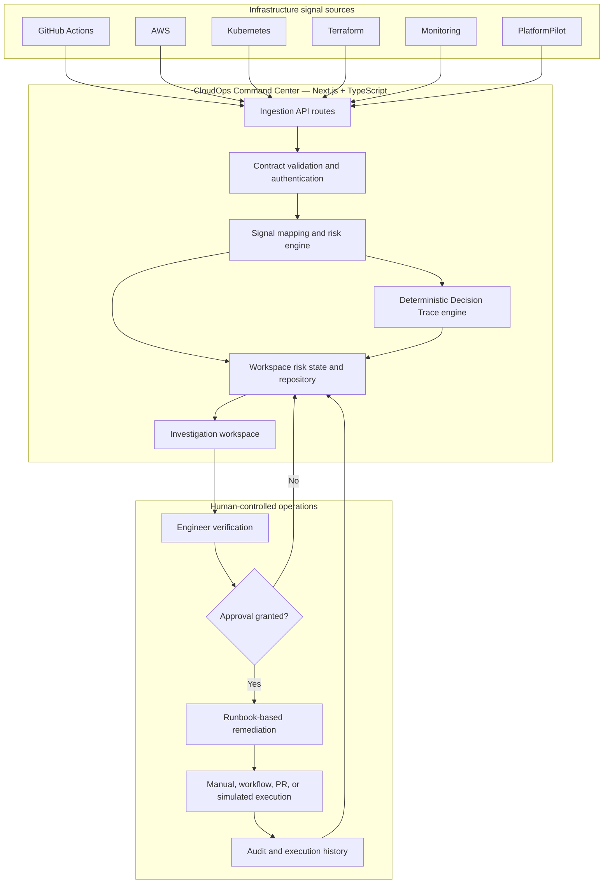
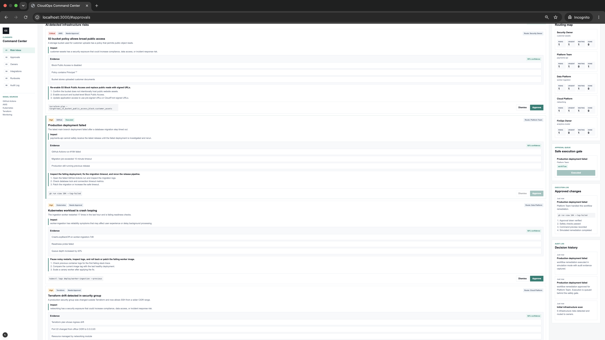
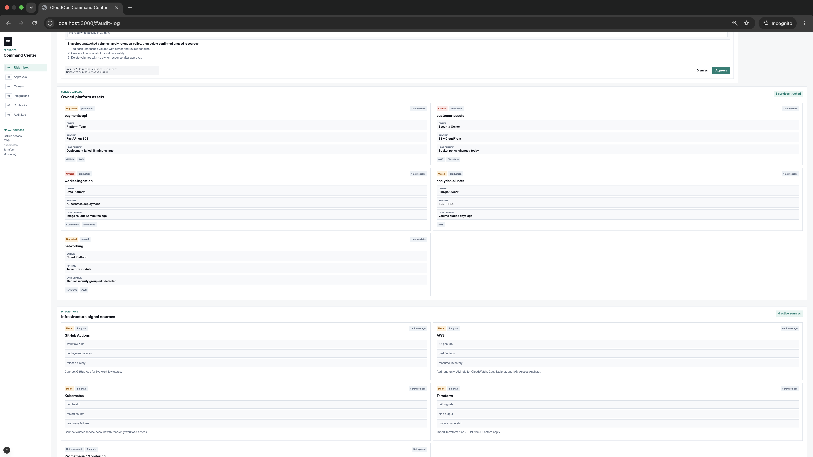
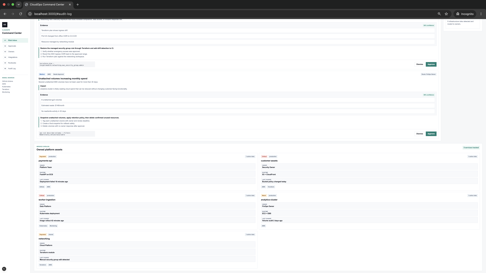
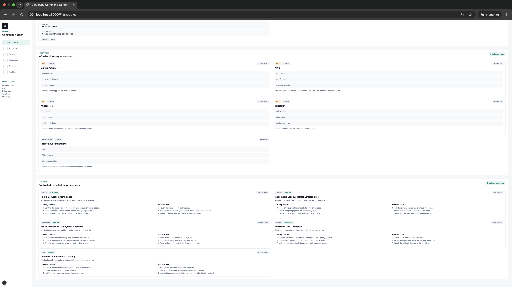

# CloudOps Command Center

CloudOps Command Center is a platform engineering assistant that turns infrastructure signals into explainable, owner-routed, approval-gated remediation workflows.

It brings risk detection, raw evidence, service ownership, deterministic Decision Traces, runbooks, human approvals, controlled execution, and audit history into one operational workspace.

## Project Overview

The overview below summarizes the investigation experience, system architecture, five-step Decision Trace, safety boundary, and core technology stack.



## Problem It Solves

Cloud and platform teams receive signals from GitHub Actions, AWS, Kubernetes, Terraform, and monitoring systems. Seeing an alert is only the beginning. Engineers still need to determine:

- What is risky and why does it matter?
- Which service and environment are affected?
- What evidence supports the recommendation?
- Who owns the service?
- What must be verified before remediation?
- Is human approval required?
- Can the decision and resulting action be audited later?

CloudOps Command Center connects those questions into one controlled workflow.

## Core Workflow

```text
Infrastructure signal
        ↓
Validation and risk mapping
        ↓
Raw evidence + service ownership
        ↓
Deterministic Decision Trace
        ↓
Engineer verification
        ↓
Human approval boundary
        ↓
Controlled remediation
        ↓
Audit and execution history
```

## Decision Trace

Each supported risk can include an auditable Decision Trace with five typed steps:

```text
Premise → Reasoning → Hypothesis → Verification → Conclusion
```

Every step has a stable ID, explicit dependencies, and a confidence value bounded between `0` and `1`. The premise cites supplied evidence, the hypothesis remains conditional, the verification step names what an engineer must check, and the conclusion preserves the approval boundary.

This is a deterministic application artifact—not hidden chain-of-thought. It uses structured evidence and fixed templates, does not require MCP or an LLM, and cannot authorize or execute infrastructure changes.

PlatformPilot risks continue to enforce:

```text
approvalRequired: true
status: needs_approval
executionMode: manual
```

## Investigation Workspace



The investigation workspace separates overview work from detailed analysis:

- The left-hand queue supports search plus severity and source filters.
- Selecting a risk opens its service, owner, source, confidence, and execution metadata.
- Raw evidence is preserved separately from interpretation.
- The trace shows how each reviewable step depends on earlier evidence.
- Approval controls remain outside the trace itself.

### Complete Decision Trace


This view shows the complete five-step trace. Confidence decreases as the trace moves from source observations toward a hypothesis and conclusion, reflecting increasing uncertainty. The final panel makes the operational boundary explicit: no infrastructure change runs from the trace, and a human must review the evidence before remediation.

## Architecture


```mermaid
flowchart TB
    subgraph Sources["Infrastructure signal sources"]
        GH["GitHub Actions"]
        AWS["AWS"]
        K8S["Kubernetes"]
        TF["Terraform"]
        MON["Monitoring"]
        PP["PlatformPilot"]
    end

    subgraph App["CloudOps Command Center — Next.js + TypeScript"]
        API["Ingestion API routes"]
        VALIDATE["Contract validation and authentication"]
        MAP["Signal mapping and risk engine"]
        TRACE["Deterministic Decision Trace engine"]
        STATE["Workspace risk state and repository"]
        UI["Investigation workspace"]
    end

    subgraph Control["Human-controlled operations"]
        VERIFY["Engineer verification"]
        APPROVE{"Approval granted?"}
        RUNBOOK["Runbook-based remediation"]
        EXEC["Manual, workflow, PR, or simulated execution"]
        AUDIT["Audit and execution history"]
    end

    GH & AWS & K8S & TF & MON & PP --> API
    API --> VALIDATE --> MAP
    MAP --> TRACE
    MAP --> STATE
    TRACE --> STATE --> UI
    UI --> VERIFY --> APPROVE
    APPROVE -- "No" --> STATE
    APPROVE -- "Yes" --> RUNBOOK --> EXEC --> AUDIT
    AUDIT --> STATE
```

### Architectural responsibilities

| Layer | Responsibility |
| --- | --- |
| Signal sources | Supply workflow, cloud, cluster, plan, and monitoring observations. |
| Ingestion APIs | Accept supported inputs without granting execution authority. |
| Validation and authentication | Reject malformed or unauthorized PlatformPilot findings before storage. |
| Risk engine | Normalizes signals into categorized, owner-routed infrastructure risks. |
| Decision Trace engine | Produces deterministic, evidence-backed steps with bounded confidence and dependencies. |
| Repository | Uses Postgres when configured and an in-memory demo fallback for local development. |
| Investigation workspace | Presents the queue, raw evidence, trace, recommendation, and approval boundary. |
| Human-controlled operations | Requires verification and approval before runbook-based remediation. |
| Audit history | Records scans, approvals, dismissals, and executed remediation events. |

## Features

- Searchable risk inbox with severity, source, status, service, owner, and confidence context
- Deterministic Decision Traces over PlatformPilot findings and demo risks
- Raw evidence preserved separately from hypotheses and conclusions
- Owner routing and service catalog
- Approval queue and permission-aware controls
- Runbooks with safety checks and rollback plans
- GitHub Actions workflow-failure import
- Terraform plan JSON risk detection
- PlatformPilot contract validation and authenticated ingestion
- Execution and audit history
- Responsive investigation workspace

## Technology Stack

- Next.js and React
- TypeScript
- Vitest
- GitHub Actions
- AJV and JSON Schema
- Optional Clerk authentication
- Neon/Postgres-ready persistence
- Vercel-ready deployment

## Validation

```bash
npm run test
npm run lint
npm run typecheck
npm run build
npm run contracts:validate
```

Latest Decision Trace verification:

- 11 test files passed
- 36 tests passed
- ESLint passed
- TypeScript checking passed
- Production build passed
- Operational-finding contract validation passed
- Browser interaction testing completed without console errors

## Local Development

```bash
npm install
npm run dev
```

Open [http://localhost:3000](http://localhost:3000).

### Production environment variables

```bash
NEXT_PUBLIC_CLERK_PUBLISHABLE_KEY=
CLERK_SECRET_KEY=
DATABASE_URL=
DATABASE_SSL=true
GITHUB_TOKEN=
PLATFORM_PILOT_INGEST_TOKEN=
```

Apply the database schema after configuring `DATABASE_URL`:

```bash
npm run db:apply
```

## Additional Screenshots

### Approval and execution flow



Shows how an approved risk enters the execution gate and becomes part of the audit trail.

### Owner routing



Summarizes urgent, waiting, approved, and completed work for each service owner.

### Service catalog



Connects services with owners, environments, runtimes, integrations, health, and active risks.

### Integration status


Shows which infrastructure signal sources are connected, mocked, or awaiting configuration.

### Runbooks



Documents controlled remediation procedures, safety checks, and rollback plans.

## Skills Demonstrated

- Platform engineering: service ownership, runbooks, approvals, operational safety, and auditability
- Cloud engineering: AWS, Kubernetes, Terraform, deployment, reliability, security, and cost risk modeling
- DevOps: GitHub Actions, contract validation, testing, production builds, and deployment readiness
- Product engineering: workflow-driven UX, explainable decision artifacts, responsive design, and portfolio documentation

## Author

Olawale Azeez  
AWS Certified Solutions Architect – Associate  
AWS Certified Cloud Practitioner  
Cloud Engineer | Platform Engineer | DevOps Engineer
